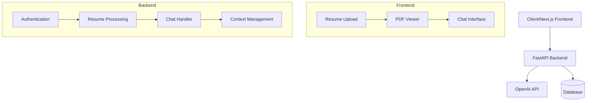

# AI Resume Chatbot

An intelligent chatbot that analyzes resumes and provides personalized feedback using AI. Built with Next.js, FastAPI, and OpenAI's GPT-4.

## Architecture


## Features

- 📄 PDF Resume Upload & Preview
- 💬 Real-time Chat Interface
- 🤖 AI-powered Resume Analysis
- 🔒 Secure Authentication
- 💡 Smart Suggestions
- 🎯 Contextual Feedback

## Screenshots

### Home Page

*Landing page with resume upload functionality*

### Chat Interface

*Split view with PDF preview and chat interface*

## Tech Stack

- **Frontend**
  - Next.js 14
  - React
  - NextAuth.js

- **Backend**
  - FastAPI
  - OpenAI API
  - Firebase database

## Getting Started

1. **Clone the repository**

2. **Install dependencies**

3. **Set up environment variables**

4. **Run the development servers**

## API Endpoints

| Endpoint | Method | Description |
|----------|---------|------------|
| `/chat` | POST | Send message to chatbot |
| `/upload` | POST | Upload resume file |
| `/auth/token` | POST | Get authentication token |

## Project Structure
```
resume-chatbot/
├── frontend/
│   ├── src/
│   │   ├── app/
│   │   │   ├── components/
│   │   │   ├── page.js
│   │   │   └── layout.js
│   │   └── styles/
│   └── public/
└── backend/
    ├── app/
    │   ├── routes/
    │   ├── models/
    │   └── services/
    └── main.py
```

## Contributing

1. Fork the repository
2. Create your feature branch (`git checkout -b feature/AmazingFeature`)
3. Commit your changes (`git commit -m 'Add some AmazingFeature'`)
4. Push to the branch (`git push origin feature/AmazingFeature`)
5. Open a Pull Request

## License

This project is licensed under the MIT License - see the [LICENSE](LICENSE) file for details.

## Acknowledgments

- OpenAI for GPT-4 API
- Next.js team for the amazing framework
- FastAPI team for the efficient backend framework